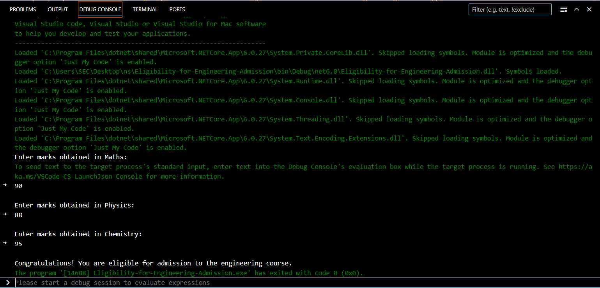

# Eligibility-for-Engineering-Admission
## Aim:
To write a C# program to check whether the student is eligibile for the engineering admission

## Algorithm:
### Step1: 
Get the maths, chemistry and physics marks from the user using ReadLine().
### Step2: 
Calculate the sum of all three subjects and check whether the sum is greater than and equal to 180

### Step3:
Calculate the sum of physics and maths and check the condition

### Step4:
Add the mark of maths and physics and check the condition whether it is greater 140

### Step5:
If the student mark is passed in all condition then print You are eligible for admission 

### Step6:
If the student mark is low then print You are not eligible for admission

## Program:
```
using System;

class Program
{
    static void Main(string[] args)
    {
        Console.WriteLine("Enter marks obtained in Maths:");
        int mathsMarks = Convert.ToInt32(Console.ReadLine());

        Console.WriteLine("Enter marks obtained in Physics:");
        int physicsMarks = Convert.ToInt32(Console.ReadLine());

        Console.WriteLine("Enter marks obtained in Chemistry:");
        int chemistryMarks = Convert.ToInt32(Console.ReadLine());

        int totalMarks = mathsMarks + physicsMarks + chemistryMarks;

        if (mathsMarks >= 65 && physicsMarks >= 55 && chemistryMarks >= 50 && (totalMarks >= 180 || (mathsMarks + physicsMarks) >= 140))
        {
            Console.WriteLine("Congratulations! You are eligible for admission to the engineering course.");
        }
        else
        {
            Console.WriteLine("You are not eligible for admission to the engineering course.");
        }
    }
}
```
## Output:


## Result:
Thus the above C# program to check the eligibility of engineering admission is successfully executed

